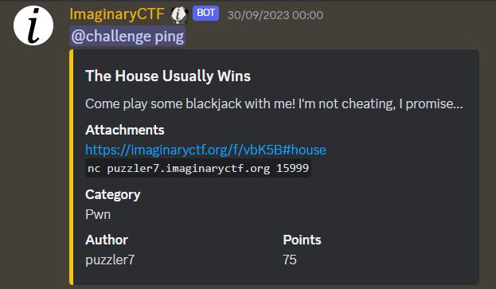

# The House Usually Wins



## Bug

- Trong hàm `enter_name` có bug sau:

```c
  while ( *s != 10 )
    ++s;
  result = s;
  *s = 0;
  return result;
```

> nghĩa là while đế khi == 10 sẽ gán 10 bằng 0

- Thông qua đó ta sẽ tận dụng khi chơi 10 lần sẽ `enter_name` để từ đã chơi 10 -> chơi 0 lần

## Kết quả


