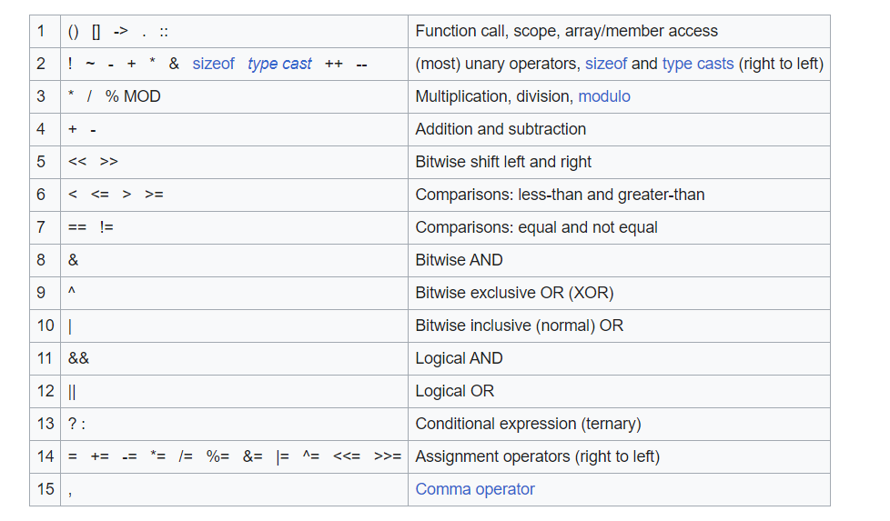

# mistake

## Phân tích

- Một lỗi logic về thứ tự ưu tiên của toán tử (operator priority)



- Và ta nhìn ở đây `!(len=read(fd,pw_buf,PW_LEN) > 0)`

```c
if(!(len=read(fd,pw_buf,PW_LEN) > 0)){
        printf("read error\n");
        close(fd);
        return 0;
}
```
- Toán tử `=` có độ ưu tiên thấp hơn `>`, Nên chương trình thực hiện như sau
`read() > 0 (T) ===> len = 1 (T) ===>  !(T) bằng 0`

## Khai thác
```
mistake@pwnable:~$ ./mistake
do not bruteforce...
BBBBBBBBBB
input password : CCCCCCCCCC
Password OK
Mommy, the operator priority always confuses me :(
```